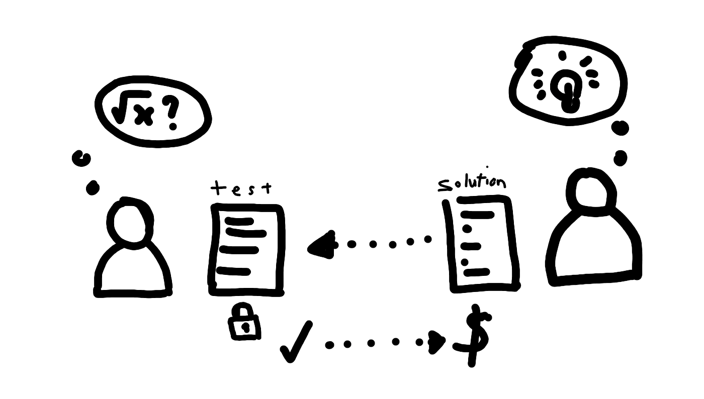

# TruCol [](https://solidity.readthedocs.io/en/v0.8.1/installing-solidity.html) [](http://nodejs.org/download/)  [](https://www.gnu.org/licenses/agpl-3.0) [](https://travis-ci.com/v-bosch/TruCol)

TruCol aims at building a decentralized, trust-less platform for test-driven programming development.

## Description

Suppose Alice wants some well-defined challenge, such as an 'n\*n' sudoku, to be solved and writes a set of unit tests that check any solution using random inputs. Instead of creating the solution, Alice publishes the unit tests in a smart contract and sets a bounty for any other smart contract that solves it. Bob the bounty hunter can then see the contract and write a solution in a smart contract and get the reward. This repository presents the protocol to do this completely trustless and decentralised without taking any fees, increasing market efficiency.



## What's new?

 - By providing a protocol instead of a service, we empower the users financially whilst increasing their autonomy by removing the need to rely on an over-arching bounty platform that takes money from the work of users. 
 - Sharing a completely open and deterministic payout protocol, removes bias from "the hiring process"*.
 - Presenting a protocol instead of a service makes the free market for test driven development (significantly more) resilient against takedowns.

## Weaknesses

0. Currently, the fully trustless decentralised version of the protocol is only implemented in Solidity, to Solidity. This is  a significant constraint on the adoptability as most test-driven development happens in other languages like Python/C etc. [Issue 5](https://github.com/v-bosch/TruCol/issues/5) describes how the protocol can be expanded to facilitate other languages
1. The costs of evaluating unit tests and solutions on chain can be significant. Scalability in costs through expansion of the chain of trust and/or allowing users to reduce decentralisation might allow users to make their own decision on "safety/costs".
2. *The bias in "the hiring process" is only removed for test driven development jobs.
3. *The bias in "the hiring process" is still present based on the language that sponsors write their code in. Additionally, bounty hunters and sponsors still require access to the internet to enter this free market.
4. Documentation of code can be/is important yet cannot (yet) be fully deterministically/reliably be assessed on quality in this protocol.
5. Code readability (e.g. sensible variable names) is not yet completely deterministically/reliably assessable in this protocol.

## Content
The content of this repository is divided into three categories. The three listed potentially somewhat overlapping applications of decentralisation technologies are developed to give the user a wider range of choice.

### Protocol
 - This repository contains three pairs of solidity contracts of which two pairs are a proof of concept of the protocol. The third set/pair of contracts is the `metacoin` Truffle unit testing example that shows how to write unit tests for solidity contracts. 
 
### GUI/website
 - Additionally a website is written in NodeJS that makes writing their bounty contracts and solidity unit tests as simple as possible. Simplification is done by providing solidity contract templates, (gas costs estimates and through automated Truffle unit testing using Travis-CI (future work)) in branch [nodey-docker](https://github.com/v-bosch/TruCol/tree/nodey-docker).

### Decentralisation techniques
 - Randomness (used to prevent the bounty hunter from hardcoding solutions) is absorbed from Chainlinks' VRF in branch [poly-sol](https://github.com/v-bosch/TruCol/tree/poly-sol).
 - An approach to perform api-calls to GitHub to [facilitate all languages (instead of Solidity only)](https://github.com/v-bosch/TruCol/issues/5) using Tellor is included in branch [tellor](https://github.com/v-bosch/TruCol/tree/tellor).
 - An approach to store a secret (used to prevent the bounty hunter from hardcoding solutions) using NuCypher is implemented [here](https://github.com/v-bosch/TruCol/tree/nucypher).

## Usage

To use the protocol, clone this repo, and modify the `test` and `checkQueens` function of the [sponsor contract](https://github.com/v-bosch/TruCol/blob/main/contracts/AskNQueens.sol) such that they contain the unit tests for your challenge (in NP). Next, we recommend you modify the [TestMetaCoin](https://github.com/v-bosch/TruCol/blob/main/test/TestMetaCoin.sol) or [TestSolveNQueens.sol](https://github.com/v-bosch/TruCol/blob/main/test/TestSolveNQueens.sol) to throw some solutions into your unit tests and check if they catch true and false solutions correctly. You can test your solidity contract with the unit tests using Truffle.

### Truffle Testing
Documentation is [here](https://www.trufflesuite.com/docs/truffle/getting-started/installation), video instructions is [here](https://www.youtube.com/watch?v=2fSPn0-8ORs) (starts at 1:34). The following installations are written for a Linux system:
 
1. install npm on device
```
sudo apt install npm
```
2. Install truffle
```
sudo npm install -g truffle
```
5. Run truffle test to verify if your bounty contract works.
```
truffle test
```

### Manual Testing

Besides the automated testing using Truffle, you can also manually test your smart contracts. To do so you can look at [AskContract](https://github.com/v-bosch/TruCol/blob/main/contracts/AskContract.sol) which consists of a square root problem and the [SolveContract](https://github.com/v-bosch/TruCol/blob/main/contracts/SolveContract.sol) which is able to solve the problem.

Test:
- Open both contracts in https://remix.ethereum.org
- Compile (ctrl+s) and select the AskContract (Not the template!),  deploy it (optionally add a value to it)
- Copy the contract address of the AskContract
- Compile and select the SolveContract (Not the template!), paste the copied address in the deploy field and deploy it
- Finally, click on the SolveContract and click on the 'solve' function
- Now the funds should be transferred to the owner of the SolveContract

TestRefund:
- Change the expiry value in the contract to a future experidate (unix timestamp)
- Compile and select the AskContract, deploy it with a value
- Click on the AskContract and try to get the refund, when it is past your timestamp it should self-destruct otherwise it should not work

Note that only the owner of the contract (which is the person who either created or solved the contract) can activate the refund function.

## FAQ
The frequently asked questions are discussed in detail in [FAQ](https://github.com/v-bosch/TruCol/blob/main/FAQ/FAQ.md).

## Security
We welcome critical evaluations of our protocol, and have found it quite a fun exercise to analyse the attack surfaces of the various possible implementations of the protocol. To do so, please have a look [here](https://github.com/v-bosch/TruCol/blob/main/FAQ/Security.md) to check if your concern is already treated, and if not, feel free to raise an issue or even pull request that addresses the security concern.

